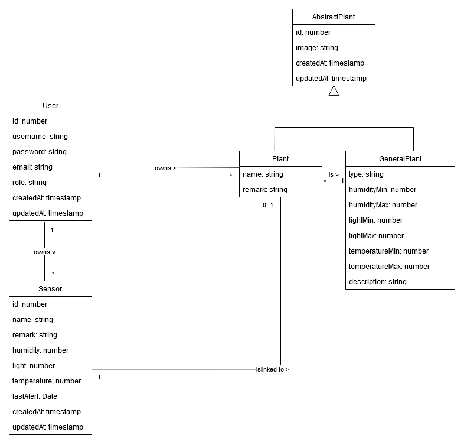
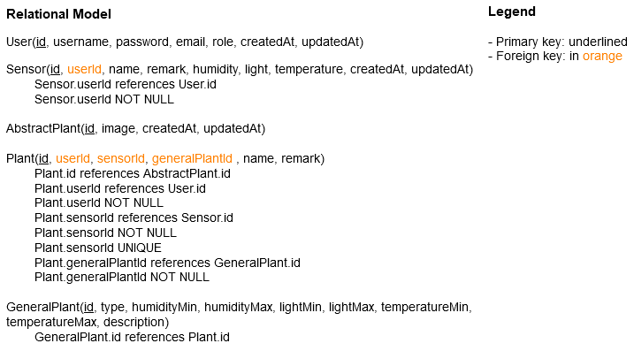

# Learn about the backend of PlantKeeper

## Original contributors

Rafael Dousse, Eva Ray, Quentin Surdez and Rachel Tranchida

## Launch backend locally

To set up and run the backend of the Plant Keeper application locally, follow the steps outlined below:

### 1. Clone the repository

First, clone the repository using the following command:

```bash
 git clone git@github.com:Plant-keeper/backend.git
```

### 2. Install Node.js and npm

Ensure you have Node.js and npm installed on your system. If not, you can install them using the following command (for
Debian/Ubuntu-based systems):

```bash
  sudo apt install nodejs npm
```

Alternatively, visit the [Node.js official website](https://nodejs.org/fr) for installation instructions tailored to
other operating systems.

### 3. Install Project Dependencies

Navigate to the root directory of the cloned repository and install the necessary dependencies using npm:

```bash
  cd backend
  npm install
```

### 4. Set up the PostgreSQL database

Add a `.env` file to the root directory of the project with the following content:

```bash
  DB_HOST=localhost
  DB_PORT=5432
  DB_USERNAME=postgres
  DB_PASSWORD=1234
  DB_NAME=test
```

Next, you need to have docker installed on your machine. You can do this by following the instructions on the
[Docker website](https://docs.docker.com/get-docker/). Create a docker container running a PostgreSQL database with the
following command:

```bash
  docker run --name db-image-postgres -e POSTGRES_PASSWORD=1234 -d -p 5432:5432 postgres
```

For the backend to work properly, you must create a database named `test` in the PostgreSQL container. You must also
create a schema named `plantkeeper_test` in the `test` database. You can do this using an IDE like DataGrip or by
running the following commands:

```bash
  docker exec -it db-image-postgres psql -U postgres -c "CREATE DATABASE test"
  docker exec -it db-image-postgres psql -U postgres -d test -c "CREATE SCHEMA plantkeeper_test"
```

### 5. Set up the mailing system

To set up the mailing system, you must add the following environment variables to the `.env` file:

```bash
  MAIL_HOST=<your_mail_host>
  MAIL_PORT=<your_mail_port>
  MAIL_SECURE=<your_mail_secure>
  MAIL_USER=<your_mail_user>
  MAIL_PASS=<your_mail_pass>
  MAIL_SENDER_NAME=<your_mail_sender_name>
 ```

This mail adress will be used to send the alert mails to the users.

This is an example of how to set up a Gmail account:

```bash
  MAIL_HOST=smtp.gmail.com
  MAIL_PORT=465
  MAIL_SECURE=true
  MAIL_USER=your-email@gmail.com
  MAIL_PASS=your-email-password
  MAIL_SENDER_NAME=Your Name
 ```

### 6. Set up the communication with the frontend

The backend is set up to enable CORS only for the PlantKeeper deployed frontend. If you want to run the frontend
locally,
you must add the following address to the list of allowed origins in the `main.ts`. The `allowedOrigin` array should
look like this.

```bash
  const allowedOrigins = [
        'https://plantkeeper.ch',
        'http://localhost:3000',
      ];
```

### 7. Run the backend

To run the backend, use the following command:

```bash
  npm run start
```

The backend should now be running on `http://localhost:4000`.

### 8. Add data to the database

To populate the database with random data, you can send a get request to the `/seed` endpoint using a tool like Postman
or Insomnia. Alternatively, you can use the following curl command to do this:

```bash
  curl http://localhost:4000/api/v1/seed
```

If you don't want random data, you will have to use the web interface to add data to the database, which you
can access at `http://localhost:3000` (if the frontend is running).

## Technical choices

In the development of the PlantKeeper backend, we made several key technical decisions to enhance scalability,
maintainability, and security. Below, we explain the reasoning behind these choices:

### 1. NestJS

We chose __NestJS__ as the core framework for building the backend of PlantKeeper:

- __Discovering new technologies__: While we are already familiar with __ExpressJS__, we wanted to explore a new
  framework
  that offers more advanced features and better structure. NestJS felt accessible, and its learning curve was manageable
  given its similarity to ExpressJS in some aspects.
- __Modular Architecture__: NestJS follows a modular architecture, which promotes better organization and code
  reusability. This modularity allows us to clearly separate features into different modules, making the codebase more
  maintainable and scalable in the long term.
- __TypeScript Support__: NestJS is built with TypeScript in mind, which ensures type safety, making the development
  process more reliable by catching potential issues during development rather than at runtime.
- __Middleware and Guards__: NestJS also provides robust features like middleware, guards, and interceptors, which we
  found beneficial in handling authentication and request validation.

By choosing NestJS, we aimed to write clean, modular, and easily scalable code while gaining experience in a more
structured server-side framework.

### 2. TypeScript

We chose to use TypeScript in the backend of PlantKeeper because it provides strong type safety, helping to catch errors
during development and reducing runtime issues. Its ability to define types for variables, objects, and function
parameters makes the code more organized and easier to maintain. Additionally, TypeScript enhances the developer
experience with features like intelligent code completion and better refactoring tools, which improve productivity. As
the project grows, TypeScript helps maintain consistency and scalability across the codebase. Its seamless integration
with modern tools like NestJS and TypeORM ensures that type definitions remain consistent throughout the application,
resulting in a more robust and maintainable system.

### 3. TypeORM

We opted to use __TypeORM__ as the Object-Relational Mapping (ORM) tool for interacting with the database because of the
following reasons:

- __Ease of Database Interaction__: With TypeORM, we can work with the database through TypeScript classes and
  object-based queries, which is much more intuitive and reduces the complexity associated with writing raw SQL queries.
- __Auto-Synchronization__:TypeORM can automatically sync the database schema based on our entity models, making
  schema management easier. This also reduces human error when creating or modifying database tables.
- __Support for PostgreSQL__: TypeORM supports multiple database systems, including PostgreSQL, which is the database
  system we chose for PlantKeeper. This compatibility ensures that we can seamlessly interact with the database without
  worrying about compatibility issues.
- __Code consistency__: Since we’re using TypeScript for both the backend logic and database models, the code remains
  consistent throughout the application. This improves code readability and ensures type safety across the project.

In the end, we chose TypeORM because it offers a higher level of abstraction for database operations while still
allowing us to
write raw SQL if necessary. It also gave us the opportunity to experience working with an ORM and evaluate whether it
simplifies database interactions compared to raw SQL.

### 4. JWT tokens for API route security

We implemented __JWT (JSON Web Tokens)__ to secure specific API routes and handle user authentication:

- __Token-Bases authentication__: JWT provides a secure, stateless way to authenticate users without needing to store
  session information on the server. Once a user logs in, a JWT token is generated and sent to the client, who then
  includes this token in the header of every subsequent request that requires authentication.
- __User identification__: The __JWT payload__ contains the user ID, which allows the backend to easily identify the
  user
  making the request. For example, for routes like `GET /users/plants`, the user ID is extracted from the JWT token, and
  the system returns only the plants associated with that user.
- __AuthGuard for route protection__: We use __AuthGuard__ in conjunction with JWT to protect certain routes, ensuring
  that
  only authenticated users with valid tokens can access them. Routes such as `GET /users/plants`, `GET /users/sensors`,
  and
  `GET /users/me` are secured by the AuthGuard. If a request is made without a valid token, access is denied, and the
  user
  is either redirected to the login page or receives an unauthorized error response.
- __Token Expiration__: JWT tokens have an expiration time, which adds an extra layer of security. If a token
  expires,
  the user must log in again to obtain a new token, reducing the risk of unauthorized access to the system. We chose
  a token expiration time of 24 hour to balance security and user convenience.

By combining JWT with AuthGuard, we enhance the security of our API, ensuring that only authenticated users can access
sensitive data and routes.

### 5. Admin token for access control on sensitive routes

To secure routes that should not be accessible publicly, we implemented an __admin token__ mechanism:

- __Admin-Only routes__: Routes like `GET /users` (which fetches all user data) are sensitive and should only be
  accessed
  by administrators. For these routes, we introduced an additional layer of security with an admin token. This token is
  sent in the header of the request and is validated before granting access to the route.
- __Token validation__: The token includes the user ID and a hash. The backend checks if the user ID exists and if the
  hash matches the stored value. If the token is valid, the request is accepted. If not, access is denied.
- __Hardcoded token__: Currently, the token validation logic and associated hashes are hardcoded within the project.
  However, we plan
  to improve this by moving the tokens and hashes to the .env file for better security and configuration flexibility.
- __Header Verification__: For each request to an admin route, a specific header is included with the token or hash.
  This allows us to verify the admin's credentials on every request and ensure that only authorized users can access or
  modify sensitive information.

## Database

We chose to use a PostgreSQL database for PlantKeeper because it offers several advantages. PostgreSQL is a powerful,
open-source, and highly reliable relational database management system. It supports ACID (Atomicity, Consistency,
Isolation, Durability) transactions, ensuring data integrity and reliability even in complex operations. PostgreSQL also
provides excellent support for JSON data types, making it versatile for handling both relational and semi-structured
data.

### Database schema



- __User__: Represents an application user.
- __Sensor__: Represents a sensor used to measure metrics of a plant.
- __AbstractPlant__: An abstract entity representing a plant, serving as a base class for the `Plant` and `GeneralPlant`
  entities.
- __Plant__: Represents a specific plant being monitored, derived from the `AbstractPlant` class.
- __GeneralPlant__: Represents a generic plant type with predefined characteristics, also derived from the
  `AbstractPlant` class.

### Views

We created two views in the database to simplify data retrieval and improve query performance:

- __`SensorsLinkedPlantView`__: This view fetches all plants and their associated sensors, providing a convenient way to
  access sensor data for each plant.
- __`UserPlantsLinkedGeneralPlantsViewEntity`__: This view fetches all plants, along with their associated sensors and
  general plant information. This view simplifies the process of retrieving plant data for a particular user.

### Database relational model



### Database relational schema


